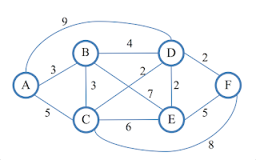
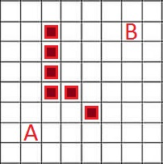

# Graphs

## About
Python implementations of Lee and Dijkstra's algorithms.

## Usage
### Dijkstra's algorithm

```python
from dijkstra_algorithm import get_path

# Adjacency matrix
arr = [
    [0, 3, 5, 9, 0, 0],
    [3, 0, 3, 4, 7, 0],
    [5, 3, 0, 2, 6, 8],
    [9, 4, 2, 0, 2, 2],
    [0, 7, 6, 2, 0, 5],
    [0, 0, 8, 2, 5, 0]
]

print(get_path(arr, 6))
# The shortest path from the start to the node 6 is 1 -> 2 -> 4 -> 6.
# The length of the path is 9.
```
The shortest path from the start to the end node is A -> B -> D -> F.

### Lee's algorithm

```python
from lee_algorithm import find_path

x = "#"  # Wall

field = [
    [0, 0, 0, 0, 0, 0, 0, 0],
    [0, 0, x, 0, 0, 0, 0, 0],
    [0, 0, x, 0, 0, 0, 0, 0],
    [0, 0, x, 0, 0, 0, 0, 0],
    [0, 0, x, x, 0, 0, 0, 0],
    [0, 0, 0, 0, x, 0, 0, 0],
    [0, 0, 0, 0, 0, 0, 0, 0],
    [0, 0, 0, 0, 0, 0, 0, 0],
]

find_path(field, (6, 1), (1, 6))
for i in field:
    print("  ".join([str(j) for j in i]))

"""
0  0  0  0  0  0  0  0
0  0  #  0  0  ^  B  0
0  0  #  0  0  ^  0  0
0  0  #  0  0  ^  0  0
0  0  #  #  0  ^  0  0
0  0  0  0  #  ^  0  0
0  A  ^  ^  ^  ^  0  0
0  0  0  0  0  0  0  0
"""
```